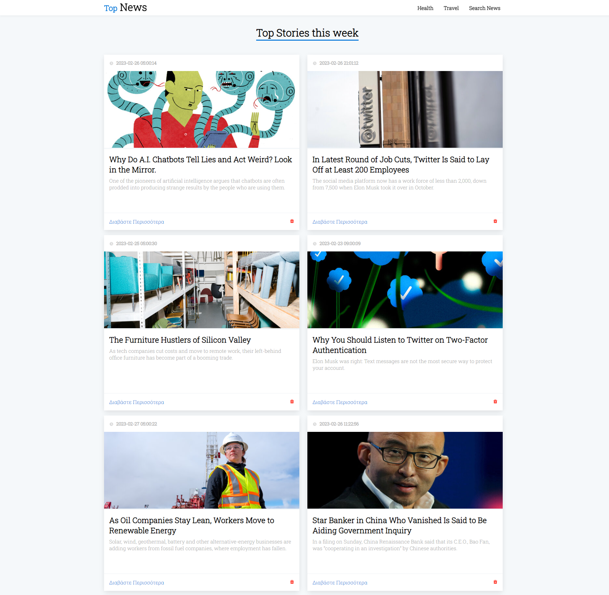
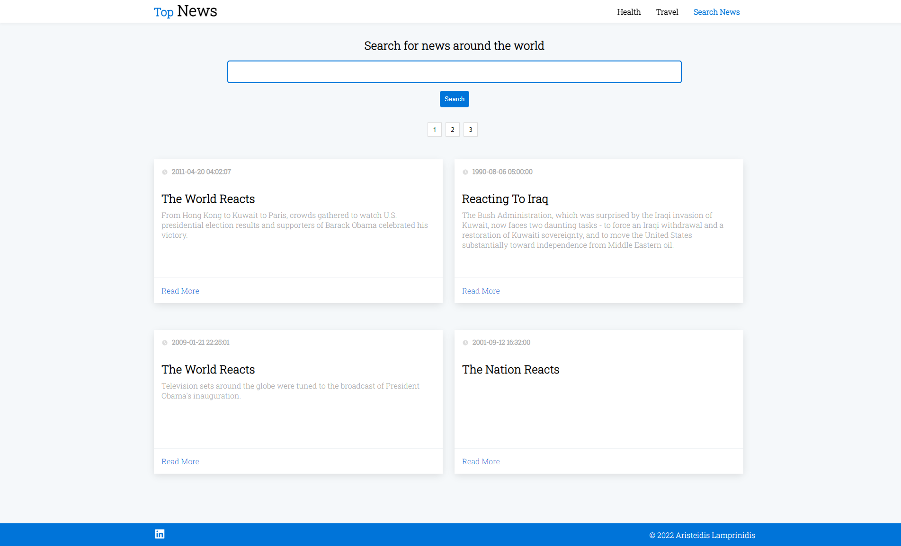

<b>Top News</b> is a website for retrieving the latest news around the world. The project's purpose was to test my 
overall knowledge in React and API. The data is being obtained from https://developer.nytimes.com/apis. Apart from showing
the news, we have the option to filter news we are not interested in. 
Finally our website with the help of the API provides a fully functional search system, for searching international news.

<b>Technologies: </b>

React, HTML, CSS, Javascript

